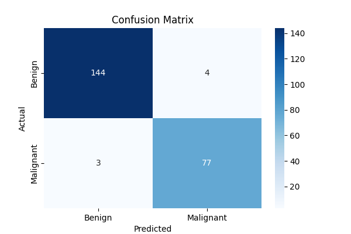

# Breast Cancer Diagnosis Model

This repository contains a machine learning pipeline for diagnosing breast cancer using logistic regression. The model is trained and evaluated on a dataset of breast cancer cases, with features extracted from cell nuclei present in digitized images of a breast mass.

## Usage

### 1. Clone the repository
```bash
git clone https://github.com/yourusername/your-repo-name.git
cd your-repo-name
```

### 2. Install dependencies
You can install the required Python packages using pip:
```bash
pip install pandas numpy scikit-learn
```

### 3. Place your data
Ensure `data.csv` is in the root directory of the project.

### 4. Run the notebook
Open `train.ipynb` in VS Code or Jupyter Notebook and run all cells sequentially.

## Dataset

The dataset (`data.csv`) should be present in the root directory. It is expected to have the following columns:
- `id`, `diagnosis` (M = malignant, B = benign), and various feature columns

## How It Works

1. **Data Loading:** Reads the dataset from `data.csv` using pandas.
2. **Data Cleaning:** Drops unnecessary columns and maps diagnosis labels to binary values.
3. **Preprocessing:** Normalizes features using `StandardScaler`.
4. **Splitting:** Splits the data into training and testing sets.
5. **Model Training:** Trains a logistic regression model on the training data.
6. **Evaluation:** Evaluates the model using accuracy and classification metrics.

## Features

- End-to-end pipeline: data loading, cleaning, preprocessing, training, and evaluation
- Uses scikit-learn's `LogisticRegression` for classification
- Data normalization with `StandardScaler`
- Handles categorical to numerical conversion for diagnosis
- Model evaluation with accuracy and classification report
- Easy to extend for other models or datasets

## Example Output
- Model accuracy on test data
- Classification report with precision, recall, and F1-score
- Confusion matrix visualization:



## Notes
- Make sure your data does not contain missing or infinite values.
- You can easily swap out the model for another classifier from scikit-learn.
- The pipeline is modular and can be extended for feature engineering or hyperparameter tuning.

## License
This project is licensed under the MIT License.

---
